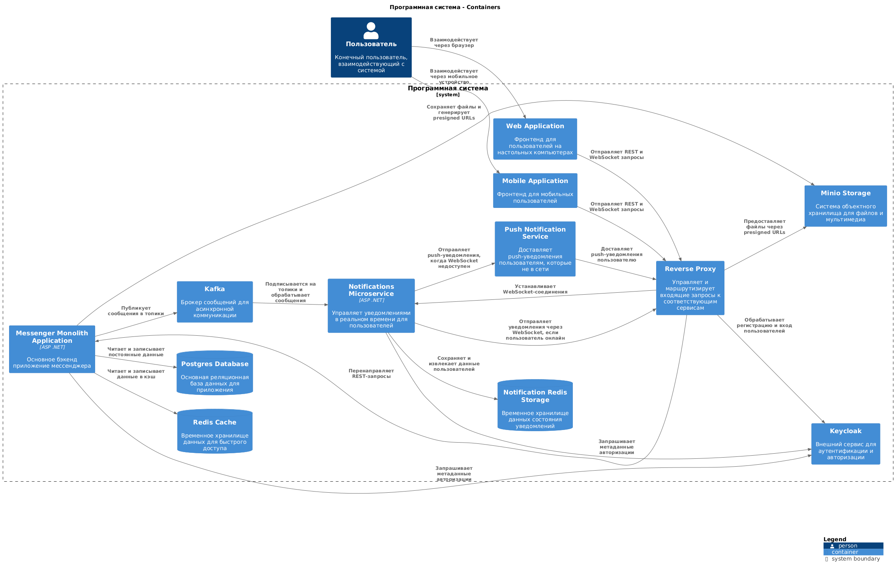
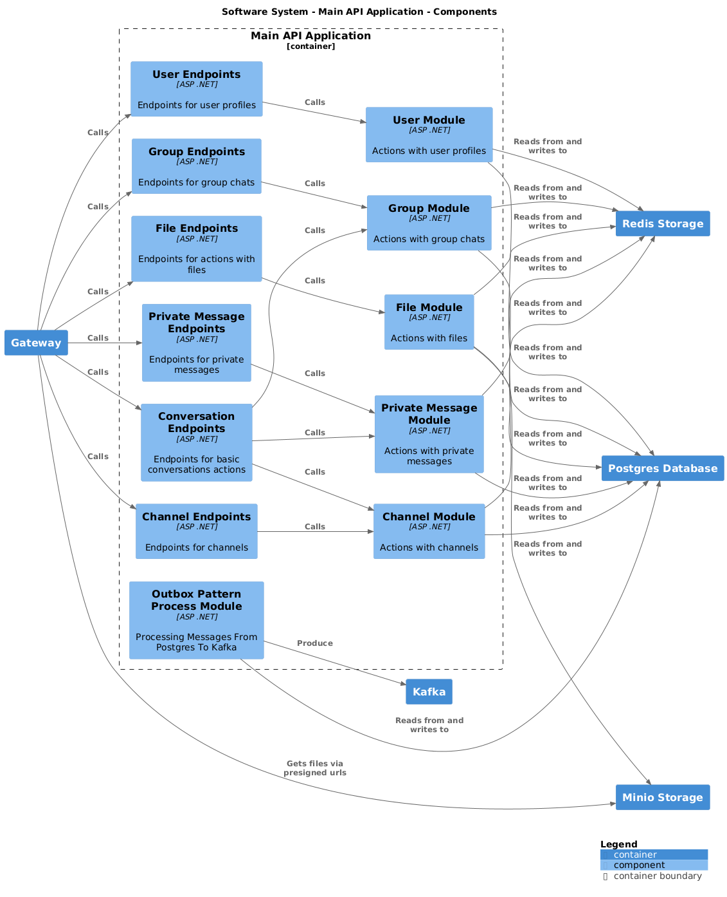
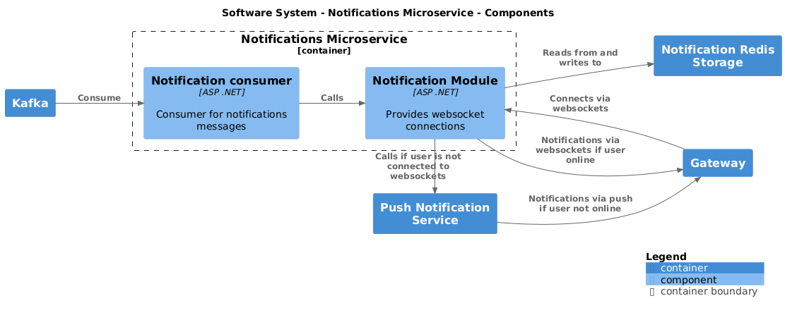

# Архитектурные схемы мессенджера

## Архитектурная схема системы

### Описание

Архитектура мессенджера спроектирована с учетом удобства взаимодействия пользователей, гибкости настройки и возможностей масштабирования.  

#### Основные компоненты:

1. **Клиентские приложения**  
   - Мобильное и веб-приложения для взаимодействия с пользователем.  

2. **Reverse Proxy**  
   - Используется **Traefik** для скрытия внутренней структуры системы и обеспечения единого домена для всех запросов.  

3. **Аутентификация и авторизация**  
   - Реализована с помощью **Keycloak** — мощного внешнего сервиса с гибкими настройками.  

4. **Бэкенд**  
   - Основное приложение — монолит на **ASP .NET**, отвечающий за большую часть функционала.  

5. **Хранилище файлов**  
   - **Minio** используется для хранения загруженных файлов и создания готовых ссылок для их получения.  

6. **Кэш и быстрые данные**  
   - **Redis** применен для кэширования и хранения некоторых данных.  

7. **База данных**  
   - Основная база данных — **PostgreSQL**, благодаря ее надежности, высокой производительности и возможностям масштабирования.

8. **Микросервис уведомлений**  
   - Уведомления вынесены в отдельный микросервис, так как это одна из самых нагруженных частей системы. 
   - Это позволяет масштабировать данный сервис независимо от остальной системы.  

9. **Пуш-уведомления и синхронизация хабов**  
   - **Redis** используется для хранения данных о пользователях и синхронизации SignalR-хабов.  
   - Для отправки пуш-уведомлений в случае, если пользователь не подключен к хабу, используется внешний сервис, такой как **Firebase Cloud Messaging**.  

10. **Асинхронная коммуникация**  
    - Для передачи сообщений между монолитом и микросервисом уведомлений используется **Kafka**, что обеспечивает надежность и масштабируемость передачи данных.
    - **Kafka** была выбрана исходя из предпологаемой нагрузки.  

---

## Архитектурная схема основного приложения

### Описание

Архитектура мессенджера построена с использованием подходов CQRS и Vertical Slices, что обеспечит структурированность модулей приложения. 
Также данный подход позволяет оптимизировать обработку операций чтения, что поможет в условиях высокой нагрузки, характерной для мессенджеров.

#### Основные компоненты:

1. **API Layer (Minimal API)**
   - Определяет маршруты для обработки HTTP-запросов.
   - Управляет валидацией данных и ответами клиенту.
   - Перенаправляет запросы в соответствующие обработчики.

2. **Query Handlers**
   - Обрабатывают операции чтения данных.
   - Используют репозитории для выполнения запросов.
   - Использует внешние сервисы для получения закэшированных данных.

3. **Command Handlers**
   - Выполняют команды, связанные с изменением данных.
   - Обеспечивают проверку и обработку бизнес-логики.

4. **Auth Handler**
   - Управляет логикой авторизации для защищенных маршрутов.
   - Отвечает за аутентификацию пользователей.

5. **Repositories**
   - Предоставляют интерфейсы для работы с базой данных.
   - Инкапсулируют логику доступа к данным.
   - Используются для чтения, записи и обновления данных.

6. **External Services**
   - Интеграция с хранилищами файлов, такими как MinIO.
   - Обеспечивают работу с Redis для кэширования данных.

7. **Models**
   - Представляют структуры данных, используемые в приложении.
   - Служат для передачи данных между компонентами (DTO, сущности).

8. **Outbox Pattern Process Module**
   - Асинхронно отправляет сообщения в очередь 
   - Реализует паттерн Outbox для гарантированной доставки сообщений между микросервисами.

---

## Архитектурная схема микросервиса уведомлений

### Описание

Микросервис уведомлений отделен от основного приложения с целью улучшения мастабируемости, поскольку уведомления - одна из самый нагруженных частей мессенджера.
Этот микросервис занимается отправкой уведомлений через WebSockets для реального времени, а также отправкой push-уведомлений через Firebase Cloud Messaging.

#### Основные компоненты:

1. **Consumers**
   - Используют очередь сообщений для обработки входящих событий асинхронно.
   - Получают данные о новых событиях для отправки уведомлений.

2. **Message Handlers**
   - Отвечают за обработку и форматирование данных уведомлений.
   - Используют SignalR хабы для уведомлений в реальном времени через WebSockets.
   - Интегрируются с Firebase Cloud Messaging для отправки push-уведомлений.

3. **SignalR Hubs**
   - Управляют подключениями, рассылкой сообщений и обработкой ошибок в процессе общения с клиентами через WebSockets.

4. **Auth Handler**
   - Управляет логикой авторизации для защищенных хабов.
   - Отвечает за аутентификацию пользователей.
