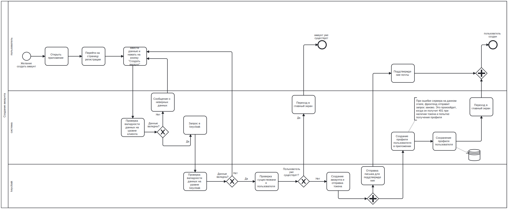
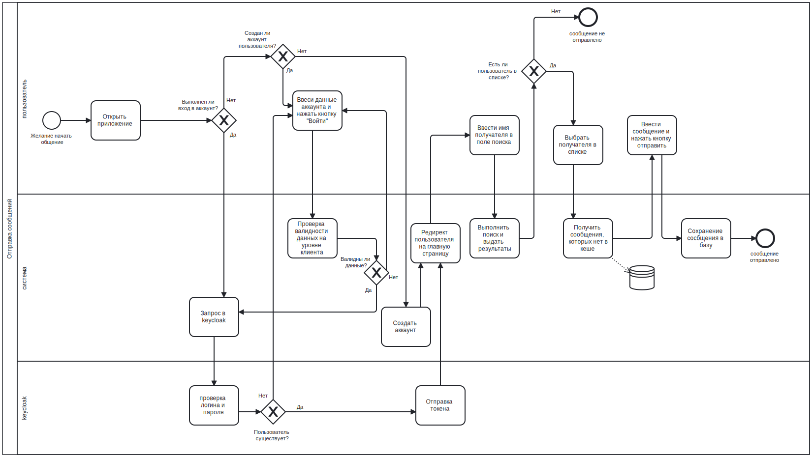
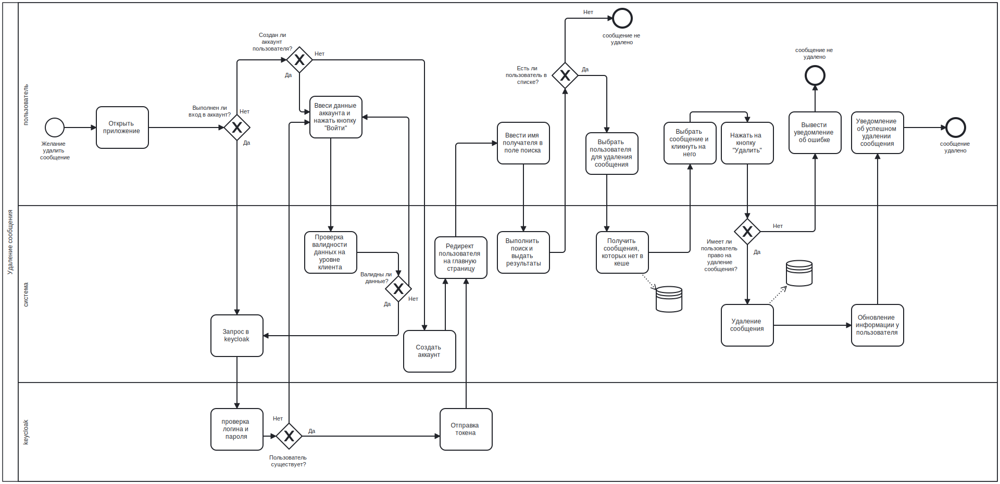

# BPMN Диаграммы для Мессенджера

Данный файл содержит BPMN (Business Process Model and Notation) диаграммы для трех ключевых процессов мессенджера.

## Диаграммы

### 1. Регистрация пользователя

Диаграмма описывает поток для регистрации нового пользователя, включая валидацию, создание аккаунта, подтверждение по электронной почте и обновление базы данных.

### 2. Отправка сообщения

Диаграмма показывает процесс отправки сообщения между пользователями, включая взаимодействие клиент-сервер и сохранение в базе данных.

### 3. Удаление сообщения

Диаграмма показывает процесс удаления сообщения, включая ввод данных пользователем, валидацию и обновление базы данных.

