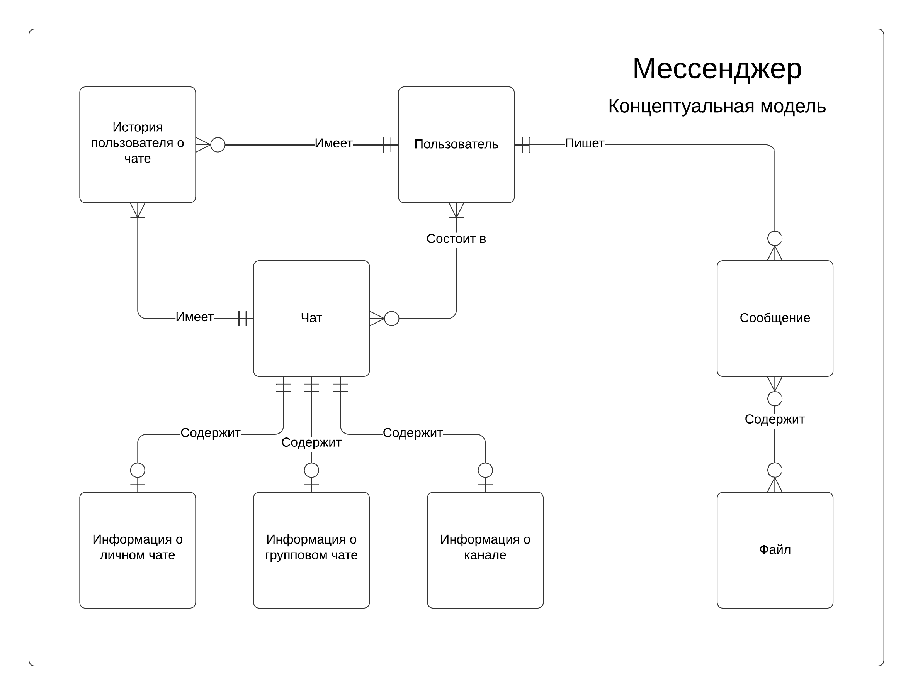
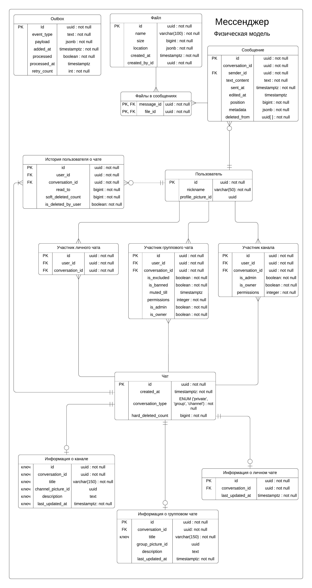

# ER-модели базы данных мессенджера

## Концептуальный уровень

---

## Логический уровень

---

## Физический уровень

---

## Описание таблиц базы данных

### 1. Файл

**Описание:** Таблица для хранения информации о загруженных файлах.

| Ключ | Атрибут         | Тип                       | Описание                                       |
| ---- | --------------- | ------------------------- | ---------------------------------------------- |
| PK   | `id`            | `uuid : not null`         | Уникальный идентификатор файла.                |
|      | `name`          | `varchar(100) : not null` | Имя файла.                                     |
|      | `size`          | `bigint : not null`       | Размер файла в байтах.                         |
|      | `location`      | `jsonb : not null`        | Метаданные о месте хранения файла (путь, URL). |
|      | `created_at`    | `timestamptz : not null`  | Дата и время загрузки файла.                   |
|      | `created_by_id` | `uuid : not null`         | ID пользователя, загрузившего файл.            |

**Индексы:**

- `id` - Индекс первичного ключа.

---

### 2. Файл в Сообщении

**Описание:** Связывает файлы с сообщениями, в которых они прикреплены.

| Ключ   | Атрибут      | Тип               | Описание                        |
| ------ | ------------ | ----------------- | ------------------------------- |
| PK, FK | `message_id` | `uuid : not null` | ID сообщения, содержащего файл. |
| PK, FK | `file_id`    | `uuid : not null` | ID связанного файла.            |

**Связи:**

- `message_id` ссылается на `id` в таблице **Сообщение**.
- `file_id` ссылается на `id` в таблице **Файл**.

**Индексы:**

- `(message_id, file_id)` - Составной индекс первичного ключа.
- `message_id` - Индекс внешнего ключа для поиска по сообщениям.
- `file_id` - Индекс внешнего ключа для поиска по файлам.

---

### 3. Пользователь

**Описание:** Таблица для хранения информации о пользователях приложения.

| Ключ | Атрибут              | Тип                      | Описание                                 |
| ---- | -------------------- | ------------------------ | ---------------------------------------- |
| PK   | `id`                 | `uuid : not null`        | Уникальный идентификатор пользователя.   |
|      | `nickname`           | `varchar(50) : not null` | Никнейм пользователя.                    |
|      | `profile_picture_id` | `uuid`                   | ID аватара пользователя (необязательно). |

**Индексы:**

- `id` - Индекс первичного ключа.

---

### 4. Сообщение

**Описание:** Таблица для хранения сообщений, отправленных пользователями.

| Ключ | Атрибут           | Тип                      | Описание                                        |
| ---- | ----------------- | ------------------------ | ----------------------------------------------- |
| PK   | `id`              | `uuid : not null`        | Уникальный идентификатор сообщения.             |
|      | `conversation_id` | `uuid : not null`        | ID чата, к которому относится сообщение.        |
| FK   | `sender_id`       | `uuid : not null`        | ID пользователя, отправившего сообщение.        |
|      | `text_content`    | `text : not null`        | Текст сообщения.                                |
|      | `sent_at`         | `timestamptz : not null` | Дата и время отправки сообщения.                |
|      | `edited_at`       | `timestamptz`            | Дата и время редактирования сообщения.          |
|      | `position`        | `bigint : not null`      | Порядковый номер сообщения в чате.              |
|      | `metadata`        | `jsonb : not null`       | Дополнительные метаданные сообщения.            |
|      | `deleted_from`    | `uuid[] : not null`      | Список пользователей, у кого сообщение удалено. |

**Связи:**

- `sender_id` ссылается на `id` в таблице **Пользователь**.

**Индексы:**

- `id` - Индекс первичного ключа.
- `sender_id` - Индекс внешнего ключа для поиска по пользователям.
- `(conversation_id, position)` - Составной индекс для обеспечения уникальности и упорядочивания сообщений внутри чата.

---

### 5. Чат

**Описание:** Таблица для хранения информации о чатах, включая их тип и метаданные.

| Ключ | Атрибут              | Тип                      | Описание                                  |
| ---- | -------------------- | ------------------------ | ----------------------------------------- |
| PK   | `id`                 | `uuid : not null`        | Уникальный идентификатор чата.            |
|      | `created_at`         | `timestamptz : not null` | Дата и время создания чата.               |
|      | `conversation_type`  | `ENUM : not null`        | Тип чата (private, group, channel).       |
|      | `hard_deleted_count` | `bigint : not null`      | Количество полностью удалённых сообщений. |

**Индексы:**

- `id` - Индекс первичного ключа.

---

### 6. История пользователя о чате

**Описание:** Таблица для хранения индивидуальной активности пользователя в чате.

| Ключ | Атрибут              | Тип                  | Описание                                       |
| ---- | -------------------- | -------------------- | ---------------------------------------------- |
| PK   | `id`                 | `uuid : not null`    | Уникальный идентификатор записи.               |
| FK   | `user_id`            | `uuid : not null`    | ID пользователя.                               |
| FK   | `conversation_id`    | `uuid : not null`    | ID чата.                                       |
|      | `read_to`            | `bigint : not null`  | Позиция последнего прочитанного сообщения.     |
|      | `soft_deleted_count` | `bigint : not null`  | Количество сообщений, удалённых пользователем. |
|      | `is_deleted_by_user` | `boolean : not null` | Указывает, удалён ли чат пользователем.        |

**Связи:**

- `user_id` ссылается на `id` в таблице **Пользователь**.
- `conversation_id` ссылается на `id` в таблице **Чат**.

**Индексы:**

- `id` - Индекс первичного ключа.
- `(conversation_id, user_id)` - Составной индекс для обеспечения уникальности и упорядочивания статусов пользователей внутри чата.

---

### 7. Участник Личного Чата

**Описание:** Таблица для хранения информации об участниках приватных чатов.

| Ключ | Атрибут           | Тип               | Описание                            |
| ---- | ----------------- | ----------------- | ----------------------------------- |
| PK   | `id`              | `uuid : not null` | Уникальный идентификатор участника. |
| FK   | `user_id`         | `uuid : not null` | ID пользователя.                    |
| FK   | `conversation_id` | `uuid : not null` | ID чата.                            |

**Связи:**

- `user_id` ссылается на `id` в таблице **Пользователь**.
- `conversation_id` ссылается на `id` в таблице **Чат**.

**Индексы:**

- `id` - Индекс первичного ключа.
- `user_id` - Индекс внешнего ключа для поиска личных чатов у пользователя.
- `conversation_id` - Индекс внешнего ключа для поиска участников личного чата.
- `(conversation_id, user_id)` - Составной индекс для обеспечения уникальности и ускорения поиска по двум столбам.

---

### 8. Участник Группового Чата

**Описание:** Таблица для хранения информации об участниках групповых чатов.

| Ключ | Атрибут           | Тип                  | Описание                                               |
| ---- | ----------------- | -------------------- | ------------------------------------------------------ |
| PK   | `id`              | `uuid : not null`    | Уникальный идентификатор участника.                    |
| FK   | `user_id`         | `uuid : not null`    | ID пользователя.                                       |
| FK   | `conversation_id` | `uuid : not null`    | ID чата.                                               |
|      | `is_excluded`     | `boolean : not null` | Указывает, исключён ли пользователь.                   |
|      | `is_banned`       | `boolean : not null` | Указывает, забанен ли пользователь.                    |
|      | `muted_till`      | `timestamptz`        | Время, до которого пользователь заглушён.              |
|      | `permissions`     | `integer : not null` | Права пользователя в группе.                           |
|      | `is_admin`        | `boolean : not null` | Указывает, является ли пользователь администратором.   |
|      | `is_owner`        | `boolean : not null` | Указывает, является ли пользователь владельцем группы. |

**Связи:**

- `user_id` ссылается на `id` в таблице **Пользователь**.
- `conversation_id` ссылается на `id` в таблице **Чат**.

**Индексы:**

- `id` - Индекс первичного ключа.
- `user_id` - Индекс внешнего ключа для поиска групповых чатов у пользователя.
- `conversation_id` - Индекс внешнего ключа для поиска участников группового чата.
- `(conversation_id, user_id)` - Составной индекс для обеспечения уникальности и ускорения поиска по двум столбам.

---

## 9. Участник Канала

**Описание:** Таблица для хранения информации об участниках каналов.

| Ключ | Атрибут           | Тип                  | Описание                                               |
| ---- | ----------------- | -------------------- | ------------------------------------------------------ |
| PK   | `id`              | `uuid : not null`    | Уникальный идентификатор участника.                    |
| FK   | `user_id`         | `uuid : not null`    | ID пользователя.                                       |
| FK   | `conversation_id` | `uuid : not null`    | ID чата.                                               |
|      | `is_admin`        | `boolean : not null` | Указывает, является ли пользователь администратором.   |
|      | `is_owner`        | `boolean : not null` | Указывает, является ли пользователь владельцем канала. |
|      | `permissions`     | `integer : not null` | Права пользователя в канале.                           |

**Связи:**

- `user_id` ссылается на `id` в таблице **Пользователь**.
- `conversation_id` ссылается на `id` в таблице **Чат**.

**Индексы:**

- `id` - Индекс первичного ключа.
- `user_id` - Индекс на внешний ключ для ускорения поиска каналов у пользователя.
- `conversation_id` - Индекс на внешний ключ для ускорения поиска участников канала.
- `(conversation_id, user_id)` - Составной индекс для обеспечения уникальности и ускорения поиска по двум столбам many-to-many таблицы.

---

## 10. Информация о канале

**Описание:** Таблица хранит дополнительные данные о канале.

| Ключ | Атрибут              | Тип                       | Описание                               |
| ---- | -------------------- | ------------------------ -| -------------------------------------- |
| PK   | `id`                 | `uuid : not null`         | Уникальный идентификатор записи.       |
| FK   | `conversation_id`    | `uuid : not null`         | ID чата-канала.                        |
|      | `title`              | `varchar(150) : not null` | Название канала                        |
|      | `channel_picture_id` | `uuid`                    | ID изображения канала (необязательно). |
|      | `description`        | `text`                    | Описание канала.                       |
|      | `last_updated_at`    | `timestamptz : not null`  | Дата и время последнего обновления.    |

**Связи:**

- `conversation_id` ссылается на `id` в таблице **Чат**.

**Индексы:**

- `id` - Индекс первичного ключа.
- `conversation_id` - Индекс на внешний ключ для ускорения поиска информации о канале.

---

## 11. Информация о групповом чате

**Описание:** Таблица хранит дополнительные данные о групповых чатах.

| Ключ | Атрибут            | Тип                       | Описание                               |
| ---- | ------------------ | ------------------------- | -------------------------------------- |
| PK   | `id`               | `uuid : not null`         | Уникальный идентификатор записи.       |
| FK   | `conversation_id`  | `uuid : not null`         | ID группового чата.                    |
|      | `title`            | `varchar(150) : not null` | Название группового чата               |
|      | `group_picture_id` | `uuid`                    | ID изображения группы (необязательно). |
|      | `description`      | `text`                    | Описание группы.                       |
|      | `last_updated_at`  | `timestamptz : not null`  | Дата и время последнего обновления.    |

**Связи:**

- `conversation_id` ссылается на `id` в таблице **Чат**.

**Индексы:**

- `id` - Индекс первичного ключа.
- `conversation_id` - Индекс на внешний ключ для ускорения поиска информации о групповом чате.

---

## 12. Информация о личном чате

**Описание:** Таблица хранит дополнительные данные о приватных чатах.

| Ключ | Атрибут           | Тип                      | Описание                            |
| ---- | ----------------- | ------------------------ | ----------------------------------- |
| PK   | `id`              | `uuid : not null`        | Уникальный идентификатор записи.    |
| FK   | `conversation_id` | `uuid : not null`        | ID приватного чата.                 |
|      | `last_updated_at` | `timestamptz : not null` | Дата и время последнего обновления. |

**Связи:**

- `conversation_id` ссылается на `id` в таблице **Чат**.

**Индексы:**

- `id` - Индекс первичного
- `conversation_id` - Индекс на внешний ключ для ускорения поиска информации о личном чате.

## 13. Outbox

**Описание:** Таблица используется для реализации Outbox паттерна. Он позволит транзакционно сохранять события для дальнейшей обработки и отправки в Kafka.

| Ключ | Атрибут         | Тип                      | Описание                                        |
| ---- | --------------- | ------------------------ | ------------------------------------------------|
| PK   | `id`            | `uuid : not null`        | Уникальный идентификатор записи.                |
|      | `event_type`    | `text : not null`        | Тип события.                                    |
|      | `payload`       | `jsonb : not null`       | Данные события в формате JSON.                  |
|      | `added_at`      | `timestamptz : not null` | Время добавления события в таблицу.             |
|      | `processed`     | `boolean : not null`     | Статус обработки события.                       |
|      | `processed_at`  | `timestamptz`            | Время завершения обработки события.             |
|      | `retry_count`   | `int : not null`         | Количество попыток повторной обработки события. |

**Индексы:**
- `id` — Индекс первичного ключа для быстрого поиска.
- `processed` — Индекс для фильтрации необработанных событий.
- `added_at` — Индекс для ускорения упорядочивания событий по времени добавления.