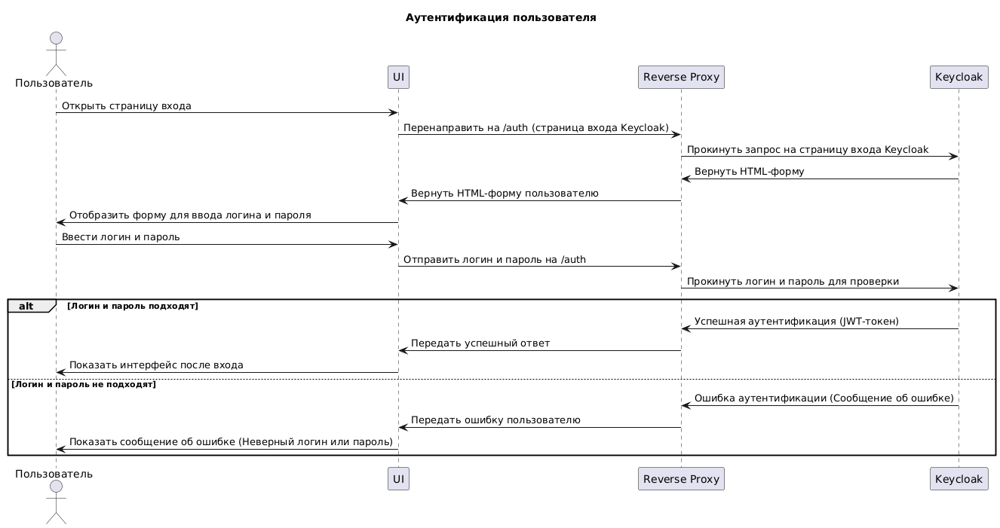
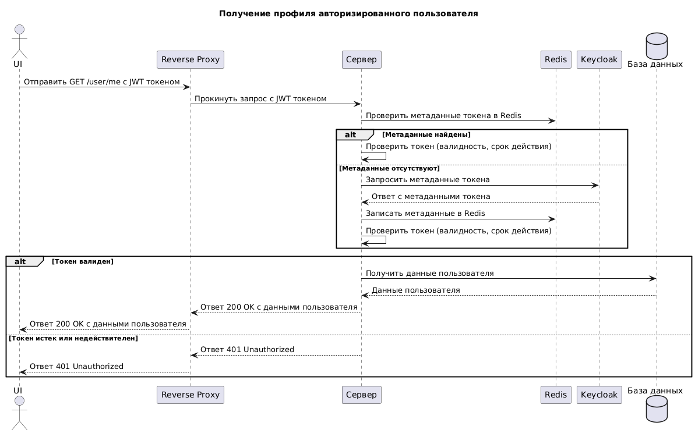
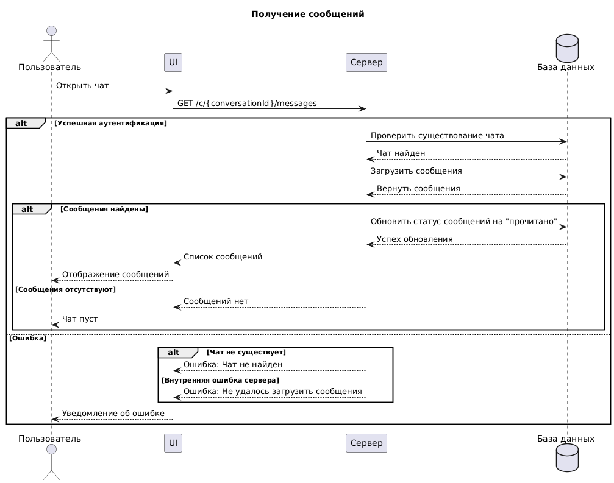
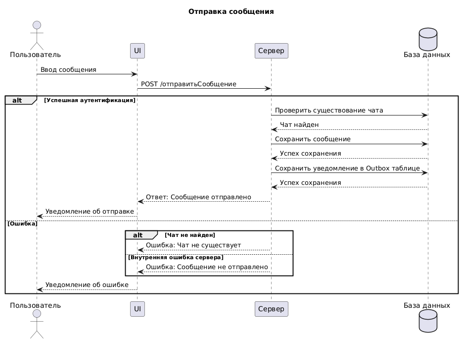
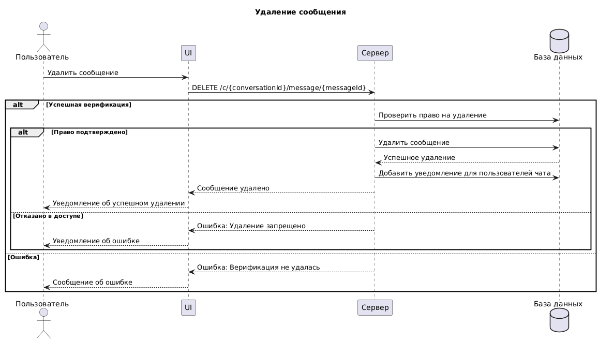

# UML Диаграммы для мессенджера

## Диаграммы последовательности

### Диаграмма последовательности аутентификации

---

### Диаграмма последовательности получения профиля пользователя

---

### Диаграмма последовательности получения сообщений переписки

---

### Диаграмма последовательности отправки сообщения

---

### Диаграмма последовательности удаления сообщения

---

## Диаграммы состояний

### Диаграмма состояний пользователя

---

### Диаграмма состояний чата

---

### Диаграмма состояний сообщения

